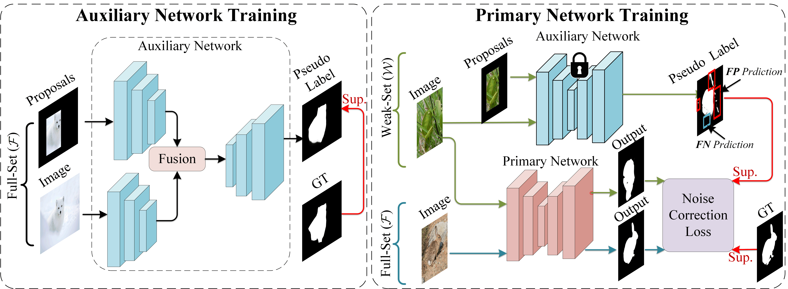
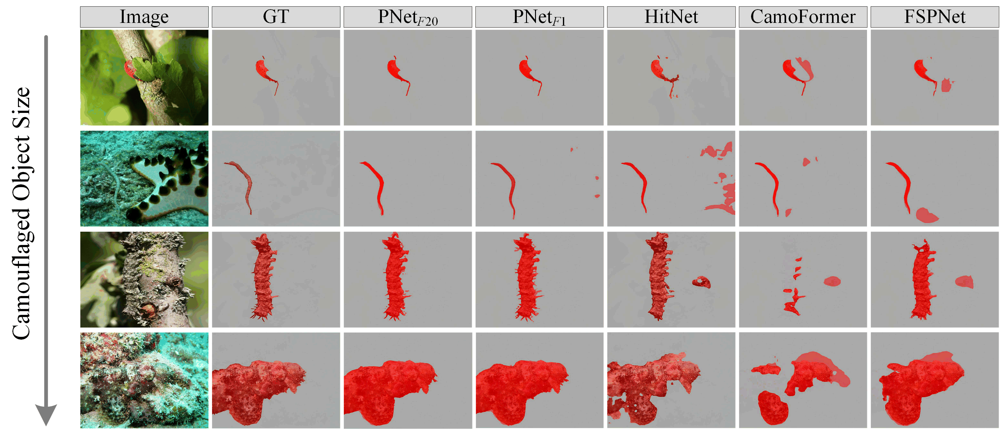

# [ECCV2024] Learning Camouflaged Object Detection from Noisy Pseudo Label

This is the open-source repository for our paper **Learning Camouflaged Object Detection from Noisy Pseudo Label**, accepted at ECCV 2024!

## Framework Architecture




## Performance




## Training Process

### Task Definition: Weakly Semi-Supervised Camouflaged Object Detection (WSSCOD)

We introduce a novel training protocol named **Weakly Semi-Supervised Camouflaged Object Detection (WSSCOD)**, utilizing boxes as prompts to generate high-quality pseudo labels. WSSCOD leverages box annotations, complemented by a minimal amount of pixel-level annotations, to generate high-accuracy pseudo labels.

1. **Dataset Division:**
   - $\mathcal{D}_m = \{\mathcal{X}_m, \mathcal{F}_m, \mathcal{B}_m\}_{m=1}^M$: Pixel-level annotations $\mathcal{F}_m$, box annotations $\mathcal{B}_m$, and training images $\mathcal{X}_m$.
   - $\mathcal{D}_n = \{\mathcal{X}_n, \mathcal{B}_n\}_{n=1}^N$: Box annotations and images, where $M+N$ represents the number of training sets.

2. **Training ANet:**
   - Train **ANet** using dataset $\mathcal{D}_m$.
   - Use $\mathcal{B}_m$ as prompts and $\mathcal{F}_m$ for supervision.

3. **Generating Pseudo Labels:**
   - Use the trained **ANet** and dataset $\mathcal{D}_n$ to predict pseudo labels $\mathcal{W}_n$.

4. **Constructing the Weakly Semi-Supervised Dataset:**
   - Combine $\{\mathcal{X}_m, \mathcal{F}_m\}_{m=1}^M$ and $\{\mathcal{X}_n, \mathcal{W}_n\}_{n=1}^N$ to form $\mathcal{D}_t$.

5. **Training PNet:**
   - Train **PNet** using the dataset $\mathcal{D}_t$.
   - Evaluate performance with different $M$ and $N$ ratios:
     - **PNet$_{F1}$**: $M=1\%$, $N=99\%$
     - **PNet$_{F5}$**: $M=5\%$, $N=95\%$
     - **PNet$_{F10}$**: $M=10\%$, $N=90\%$
     - **PNet$_{F20}$**: $M=20\%$, $N=80\%$

### Details: ANet and PNet Training

| **Aspect**                    | **ANet** (Auxiliary Network)                     | **PNet** (Primary Network)                        |
|-------------------------------|--------------------------------------------------|--------------------------------------------------|
| **Stage**                     | First                                            | Second                                           |
| **Objective**                 | Generate high-accuracy pseudo labels             | Main camouflaged object detection                |
| **Data Input**                | Subset $\mathcal{D}_m$ with pixel and box annotations | Weakly semi-supervised dataset $\mathcal{D}_t$   |
| **Training Dataset**          | $\mathcal{D}_m = \{\mathcal{X}_m, \mathcal{F}_m, \mathcal{B}_m\}_{m=1}^M$ | $\mathcal{D}_t = \{\mathcal{X}_m, \mathcal{F}_m\}_{m=1}^M \cup \{\mathcal{X}_n, \mathcal{W}_n\}_{n=1}^N$ |
| **Annotations**               | Pixel-level $\mathcal{F}_m$ and box $\mathcal{B}_m$ | Pseudo labels $\mathcal{W}_n$ and pixel-level $\mathcal{F}_m$ |
| **Supervision**               | Pixel-level $\mathcal{F}_m$ for pseudo label generation | Pseudo labels $\mathcal{W}_n$ and pixel-level $\mathcal{F}_m$ |
| **Input Prompts**             | Box annotations $\mathcal{B}_m$ for camouflaged objects | Images $\mathcal{X}_m$ and $\mathcal{X}_n$       |
| **Performance Evaluation**    | -                                                | Different settings: **PNet$_{F1}$**, **PNet$_{F5}$**, **PNet$_{F10}$**, **PNet$_{F20}$**  |
| **Training Goal**             | Generate high-quality pseudo labels $\mathcal{W}_n$ | Improve detection accuracy with various $M$ and $N$ ratios |

### 1. Download the Training and Test Sets

We have made the training and test sets available for download via the following links:

- [Google Drive](https://drive.google.com/drive/folders/1nHD-d3FanT6-ORsZTEeGgGzQ2CUKyWSe?usp=drive_link)
- [BaiDu Drive](https://pan.baidu.com/s/1xAe4s6vqONcmwQIAzKOMCQ) (Passwd: ECCV)

Once downloaded, place `data.zip` in the `code/data` directory and unzip it.

### 2. Train ANet

```bash
python code/TrainANet/TrainDDP.py --gpu_id 0 --ration 1 
# ration represents the proportion of pixel-level labels
```

### 3. Generate Pseudo Labels

```bash
python code/TrainANet/Test.py --ration 1 
# ration represents the proportion of pixel-level labels
```

### 4. Train PNet

```bash
python code/TrainANet/TrainDDP.py --gpu_id 0 --ration 1 --q_epoch 20 --batchsize_fully 6 --batchsize_weakly 24 
# ration represents the proportion of pixel-level labels
# q_epoch means we change the q to 1 at this epoch 
# batchsize_fully means the number of fully annotated samples in a batch
# batchsize_weakly means the number of weakly annotated samples in a batch
```

### 5. Testing Process

```bash
python code/TrainPNet/Test.py --ration 1 
# ration represents the proportion of pixel-level labels
```

## Pretrained Weights and COD Results

| **Model**       | **Pretrained Weight**                                                                       | **Prediction Description**       |
|-----------------|---------------------------------------------------------------------------------------------|----------------------------------|
| **PNet$_{F1}$** | [BaiDu Link](https://pan.baidu.com/s/1caIoaBSCQnfgzrKCJn7wmQ?pwd=ECCV), [Google Link](https://drive.google.com/file/d/12Hmz7cwsxB-ssN9ZYmRucmV3xYSiNb1h/view?usp=drive_link)                    | $M=1\%$, $N=99\%$                 |
| **PNet$_{F5}$** | [BaiDu Link](https://pan.baidu.com/s/1p0TzsUj8ZbGrtzhEFRM2oQ?pwd=ECCV), [Google Link](https://drive.google.com/file/d/1aWaypg0dh6PnLs8lfMYKEzc4tmn6PhQa/view?usp=drive_link)                      | $M=5\%$, $N=95\%$                 |
| **PNet$_{F10}$**| [BaiDu Link](https://pan.baidu.com/s/16no0SM4BvIhl88SRwUp-5Q?pwd=ECCV), [Google Link](https://drive.google.com/file/d/1uikuI2LDJ-K2VvGlnz57HCgJq1IA3CmF/view?usp=drive_link)                      | $M=10\%$, $N=90\%$                |
| **PNet$_{F20}$**| [BaiDu Link](https://pan.baidu.com/s/1CshkBMjQGi4r0NdXFIPCeQ?pwd=ECCV) , [Google Link](https://drive.google.com/file/d/18f2h8FZSa_KYKMgvGVOKAR15KepY8uCQ/view?usp=drive_link)                     | $M=20\%$, $N=80\%$                |

## References

```bibtex
@inproceedings{OVCOS_ECCV2024,
  title={Learning Camouflaged Object Detection from Noisy Pseudo Label},
  author={Jin, Zhang and Ruiheng, Zhang and Yanjiao, Shi and Zhe, Cao and Nian, Liu and Shahbaz Khan, Fahad},
  booktitle={ECCV},
  year={2024},
}
```
